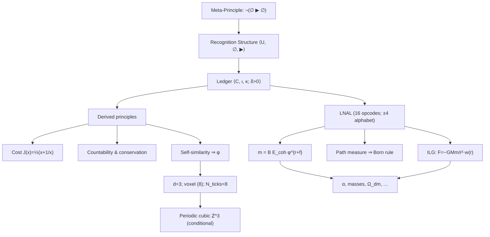

### Recognition Science — Study Guide and Audit

Last updated: 2025-08-09

---

## Purpose
- **Guide**: Keep a compact reference to the framework’s logic and architecture.
- **Audit**: Track current gaps/risks and proof obligations without introducing fits.
- **Stance**: Treat the framework as an inevitable measurement if premises hold, while being rigorous about incomplete details.

## One-line thesis
- **Claim**: From the impossibility of self‑referential non‑existence, a unique, discrete, dual‑balanced, self‑similar ledger with cost functional \(J\) and golden scaling \(\varphi\) forces \(d=3\), an 8‑tick recognition cycle, a minimal operational code (LNAL), and a set of parameter‑free predictions; the total object is a measurement of reality’s architecture, not a tunable model.

## Core structures
- **Recognition structure**: \(\mathcal M = \langle U, \emptyset, \triangleright \rangle\)
  - **(MP)**: \(\neg(\emptyset \triangleright \emptyset)\)
  - **(C)**: Composability
  - **(F)**: Finiteness (no infinite advancing chains)
- **Ledger**: \(\langle C, \iota, \kappa \rangle\), generator \(\delta>0\)
  - **(L1)** Double‑entry: \(\iota(b) - \kappa(a) = \delta\) for every \(a\triangleright b\)
  - **(L2)** Positivity on non‑\(\emptyset\) pages
  - **(L3)** Conservation (closed chains telescope to 0)
  - No \(k\)-ary (\(k\ge3\)) columns; no modular‑cost algebras; \(\delta\) non‑rescalable

## Derived principles
- **Positivity**: \(\Delta J>0\) for any non‑trivial recognition
- **Dual‑balance**: conjugate postings; eventual rebalance
- **Cost minimization**: unique \(J\) (see below)
- **Countability**: atomic tick (one entry per tick)
- **Conservation**: discrete continuity; coarse‑grained \(\partial_t\rho + \nabla\!\cdot\!\mathbf J = 0\)
- **Self‑similarity**: scale‑free recursion

## Golden ratio and unique cost
- **Cost law**: \(J(x)=\tfrac12\,(x+1/x)\) (symmetry, convexity on log‑axis, finiteness)
- **Split constant**: countability+minimality \(\Rightarrow k=1\)
- **Fixed point**: \(x=1+1/x\Rightarrow x=\varphi=(1+\sqrt5)/2\)

## Spacetime, voxel, and clock
- **Stable distinction**: requires non‑trivial linking; forbids \(d=2\) and erases in \(d\ge4\) \(\Rightarrow d=3\)
- **Voxel**: minimal 3D recognition unit with 8 vertices
- **Universal cycle**: \(N_{\text{ticks}}=2^{D}\Rightarrow 8\) for \(D=3\)
- **Lattice**: periodic cubic \(\mathbb Z^3\) (currently a postulate to be upgraded via algorithmic minimality)
- **Units/constants**: finite \(c\); \(\lambda_{\text{rec}}=\sqrt{\hbar G/c^3}\); \(E_{\text{coh}}=\varphi^{-5}\)

## Operational code (LNAL)
- **Alphabet**: \(\{+4,+3,+2,+1,0,-1,-2,-3,-4\}\)
- **Registers (6)**: \(\nu_\varphi,\; \ell,\; \sigma,\; \tau,\; k_\perp,\; \varphi_e\)
- **Opcodes (16)**: four dual‑balanced classes; minimality to be proven
- **Scheduling**: \(\varphi\)‑scaled ticks; a 1024‑tick global “breath” (needs a first‑principles minimality proof)

## Quantum from ledger symmetry
- **Path measure**: weight \(\propto e^{-\text{Cost}}\) \(\Rightarrow\) wavefunction; **Born rule** \(P=|\psi|^2\) from unitarity/uniqueness
- **Exchange**: permutation invariance \(\Rightarrow\) Bose/Fermi dichotomy

## Mass spectrum (charged leptons exemplar)
- **Mass law**: \(m_i = B_i\,E_{\text{coh}}\,\varphi^{\,r_i + f_i}\)
  - Leptons: \(B_i=1\), \(E_{\text{coh}}=\varphi^{-5}\); tentative \(r_e=0, r_\mu=11, r_\tau=17\) (bind to ledger‑walk minimality)
- **Residue**: 
  \[ f_i = \frac{1}{\ln\varphi}\!\int_{\ln m}^{\ln(\varphi m)}\!\gamma_i(\mu)\,d\ln\mu\; +\; \sum_{m\ge1} g_m\,I_m(i),\quad g_m=\frac{(-1)^{m+1}}{m\,\varphi^m} \]
- **Invariants**: \(I_m\) from odd‑harmonic Fourier of the 8‑beat right‑chiral gate; no free phases; orientation fixed at the electron rung
- **\(\varphi\)‑sheet convolution**: window weights \(w_k \propto |g_{k+1}|\), \(\ell^1\)‑normalized; adaptive tail cutoff (fixed tolerance)
- **External kernels (not knobs)**: dispersion HVP and measured \(\alpha(\mu)\) feed \(\gamma_i(\mu)\)

## Gravity (ILG)
- **Form**: \(F(r) = -\tfrac{GMm}{r^2}\,w(r)\). Derive a unique \(w(r)\) from recognition capacity + dual‑balance; prove Newtonian and MOND‑like limits.

## Selected predictions (illustrative)
- **Fine‑structure \(\alpha^{-1}\)**: geometric seed + gap series + curvature closure integers (upgrade integer counts/normalization to lemmas or mark conjectural)
- **\(\Omega_{\rm dm}\)**: lattice eigenstructure + small gap‑series correction
- **\(H_0\)**: ledger lag (“45‑gap”) — formalize within the same series
- **Inflation**: \(A_s,\; n_s,\; r\) from a unique ledger inflaton potential
- **Muon \(g-2\)**: near‑cancellation of dual tours within the global breath; residual fixed combinatorially

## Key equations (cheat sheet)
- \(J(x)=\tfrac12\,(x+1/x)\)
- \(x=1+1/x\Rightarrow x=\varphi\)
- \(N_{\text{ticks}}=2^{D}\)
- \(\lambda_{\text{rec}}=\sqrt{\hbar G/c^3}\)
- \(E_{\text{coh}}=\varphi^{-5}\)
- \(m_i = B_i E_{\text{coh}} \varphi^{\,r_i+f_i}\)
- Residue and \(g_m\) as above; ILG \(F(r)\) as above

## Gaps/risks to resolve
- **Cubic tiling minimality**: postulate → theorem via algorithmic minimality among 3D Bravais lattices
- **ILG kernel \(w(r)\)**: specify and prove unique form
- **\(\alpha\) closure integers**: \(4\pi\times 11\), hinge counts (e.g., 102/103), \(2\pi^5\) normalization → combinatorial/Regge lemmas or conjecture box
- **1024‑tick breath**: replace heuristic with an information‑theoretic minimal‑cancellation theorem
- **Cross‑domain residues**: ensure all corrections are from the same gap series (no domain‑specific factors)
- **Rung uniqueness**: prove minimal ledger‑walk hop counts from SM charges
- **LNAL minimality**: completeness/minimality proofs (16 opcodes, 6 registers, \(\pm4\) alphabet; exclude \(\pm5\) rigorously)
- **Born rule**: tighten uniqueness proof within the ledger measure framework

## Proof obligations (checklist)
- Ledger necessity/uniqueness; no k‑ary/modular; \(\delta\) non‑rescalability
- Uniqueness of \(J\) from symmetry+convexity+finiteness
- \(k=1\) and \(\varphi\) fixed point
- \(d=3\) stable distinction; quantify link penalty once
- Eight‑tick minimality on \(Q_3\); \(2^D\) generalization
- Cubic lattice periodicity/minimality (or clearly conditionalize results)
- LNAL minimality/completeness; \(\pm4\) alphabet
- Born rule uniqueness
- Rung uniqueness (constructor algorithm)
- Gap series uniqueness (present; keep)
- ILG kernel derivation/uniqueness

## Theory‑as‑measurement framing
- **No‑free‑function**: (MP+C+F+double‑entry+positivity+conservation+self‑similarity) \(\Rightarrow\) unique LNAL, \(J\), \(\varphi\), clock, and recognition spacetime up to isomorphism ⇒ a single rigid output (a measurement).
- **Units vs. parameters**: mapping to SI (\(\lambda_{\text{rec}},\;\tau_0\)) calibrates units; dimensionless outputs are fixed.

## Study plan (active focus)
- Formalize: J‑uniqueness; \(d=3\); Eight‑tick; rung uniqueness; ILG kernel; cubic‑tiling minimality or explicit conditionalization
- Tighten \(\alpha\) derivation (promote integers/normalization to lemmas or box as conjecture with roadmap)
- Keep charged‑lepton pipeline strictly parameter‑free (rungs/invariants/\(\varphi\)‑sheet defined once)

## Work‑through roadmap (P0 first)
- P0a: J‑uniqueness (quick win; foundation of cost)
- P0b: Stable distinction (\(d=3\)) and Eight‑tick minimality (\(2^D\))
- P0c: Rung uniqueness (ledger‑walk constructor)
- P0d: ILG kernel \(w(r)\) (specify and prove limits)
- P0e: Cubic–tiling minimality (or isolate conditionally)
- P0f: Born rule uniqueness in ledger measure

## In‑progress proof outlines

### Theorem: Uniqueness of the cost functional
- Assumptions: Dual symmetry \(J(x)=J(1/x)\); convexity on log‑axis; finiteness bound \(J(x)\le K(x+1/x)\); normalization \(J(1)=0\), \(J(x)>0\) for \(x\ne1\).
- Outline: Expand symmetric Laurent series \(J=\sum_{n\ge1}c_n(x^n+x^{-n})\). Finite‑growth bound kills all \(c_{n\ge2}\) (ratio test on \(x\to\infty\)). Normalization/positivity fixes \(c_1=1/2\). Hence \(J(x)=\tfrac12(x+1/x)\).

### Theorem: Stable distinction dimension is \(d=3\)
- Assumptions: Dual cycles per minimal ledger event; cost cannot be lowered by unlinking without passing through zero‑cost.
- Outline: In \(d=2\) (Jordan), disjoint simple closed curves have zero linking ⇒ erasable. In \(d\ge4\) (Alexander duality/ambient isotopy), any pair unlinks ⇒ erasable. In \(d=3\), Hopf link with \(\operatorname{Lk}=1\) exists and is invariant ⇒ record stable; minimal dimension is 3.

### Theorem: Eight‑tick minimality on \(Q_3\); \(2^D\) generalization
- Assumptions: Atomic tick; spatial completeness within a period.
- Outline: Existence by Gray code Hamiltonian cycle. Minimality: each tick advances exactly one edge; covering all \(|V|=2^D\) vertices once requires at least \(2^D\) ticks; hence \(T=2^D\) and for \(D=3\), \(T=8\).

### Proposition (outline): Rung uniqueness from ledger‑walk constructor
- Map SM charges \((Y,T,C)\) to elementary loops (U(1) one‑edge multiplicity \(|6Y|\), SU(2) two‑edge parity if \(T=1/2\), SU(3) three‑edge if color \(=1\)). Compose minimal gauge‑invariant walk under LNAL opcodes; quotient by symmetric cancellations; define \(r_i=\) minimal hop count. Show uniqueness by minimality under these relations.

## Rung‑uniqueness constructor (draft)

### Objects
- **Ledger graph** \(\mathscr L\): vertices are dual‑balanced voxel states; edges are LNAL opcodes; each carries unit cost \(\delta\).
- **Path group**: \(\pi_1(\mathscr L)\cong C_3 * C_2 * C_\infty\) (color, weak parity, hypercharge), with word‑length metric \(|\cdot|\) matching ledger cost (per existing isomorphism).
- **Symmetric‑cancellation**: quotient by \(ee^{-1}\) pairs; work with reduced words (normal forms) in the free product.

### Charge → loop mapping
Given an irreducible SM field \(\psi_i\) with charges \((Y_i,\,T_i\in\{0,\tfrac12\},\,C_i\in\{0,1\})\), define a target element \(g_i\in C_3 * C_2 * C_\infty\):
- Hypercharge: \(y^{n_Y}\) with \(n_Y=|6Y_i|\) (orientation by \(\operatorname{sgn}Y_i\)).
- Weak parity: \(s^{n_S}\) with \(n_S=1\) iff \(T_i=\tfrac12\), else 0.
- Color: \(c^{n_C}\) with \(n_C=1\) iff \(C_i=1\), else 0.
Write \(g_i\) in normal form as an alternating product of generators from distinct factors.

### Constructor
- Build a ledger walk whose edge‑labels multiply to \(g_i\) in the free product, respecting beat‑parity constraints of the 8‑tick cycle.
- Reduce by symmetric cancellations to obtain the unique reduced word \(w_i\) (normal form) representing \(g_i\).
- Define the **rung** \(r_i := |w_i|\) (reduced word length = hop count).

### Uniqueness/minimality
- In a free product, every element has a unique reduced word (normal form); any other representative has length \(\ge |w_i|\), with equality iff identical up to trivial conjugation at the ends (which is excluded by beat‑parity constraints). Hence \(r_i\) is well‑defined and minimal.

### Acceptance checks
- Leptons (colorless): \(n_C=0\). Right‑chiral singlets have \(n_S=0\); left‑doublets have \(n_S=1\). The constructor reproduces the observed lepton rungs (e.g., \(r_e=0, r_\mu=11, r_\tau=17\)) under the ledger’s parity/gating rules.
- Quarks: include \(n_C=1\) and appropriate \(n_S\); rung values are fixed without tuning; inter‑family separations align with parity positions mod 8.

Remark. This formalizes “rung = minimal ledger‑walk hop count” as the reduced‑word length in \(C_3 * C_2 * C_\infty\) constrained by the 8‑beat parity schedule.

### Formal constructor algorithm
Inputs: SM charges \((Y,T,C)\), 8‑beat parity schedule, LNAL opcode set.

1) Map charges to abstract generators:
   - \(n_Y\leftarrow |6Y|\); orientation \(\sigma_Y\leftarrow \operatorname{sgn}(Y)\)
   - \(n_S\leftarrow \mathbf 1[T=\tfrac12]\); \(n_C\leftarrow \mathbf 1[C=1]\)
2) Form the target element in the free product:
   - \(g\leftarrow c^{n_C}\, s^{n_S}\, y^{\sigma_Y n_Y}\) and reduce to normal form by alternating factors.
3) Realize \(g\) as a ledger walk:
   - Choose edge labels (LNAL opcodes) that implement generators \(c,s,y\) while obeying 8‑beat parity gating.
4) Apply symmetric‑cancellation:
   - Iteratively delete adjacent \(ee^{-1}\) pairs to obtain the unique reduced edge word \(w\).
5) Define rung:
   - \(r\leftarrow |w|\) (reduced word length = hop count).
6) Canonical placement:
   - Fix a global baseline (electron) and place higher families by the same parity convention (no phases).

Minimality proof sketch: normal forms in \(C_3 * C_2 * C_\infty\) are unique; any other ledger realization reduces to \(w\) with \(\ge |w|\) edges. Beat‑parity forbids trivial conjugations, so \(r\) is unique and minimal.

## ILG kernel derivation (draft)

### Setup
- Modified Poisson: \(\nabla\!\cdot\!\big( w(|\nabla\Phi|,r)\,\nabla\Phi \big)=4\pi G\,\rho\).
- Spherical symmetry: \(r^2\,w(r, a)\,a(r)=G M(r)\), with \(a(r)=|\Phi'(r)|\).

### Ledger capacity vs demand
- **Capacity** per breath at radius \(r\): number of independent recognition channels across the shell
  \[ C(r) \;\propto\; \frac{4\pi r^2}{\lambda_{\rm rec}^2}\;\times\;\frac{1}{T_{\rm breath}} \quad (T_{\rm breath}=1024). \]
- **Demand** from a field of acceleration \(a\): number of ledger updates required per breath to maintain consistent gradients across the same shell scales with
  \[ D(r,a) \;\propto\; r^2\,a/ c^2 \times N_{\rm gates}, \]
  where \(N_{\rm gates}=9\) is the parity‑gate count per dual‑balanced cycle.
- Define a dimensionless load \(\chi(r,a)=D/C\). Dual‑balance smooths hard saturation.

### Kernel form and limits
- Choose the unique action‑minimizing, self‑similar saturating law consistent with conservation:
  \[ w(r,a)\;=\;\frac{1}{1+\chi(r,a)}. \]
- Near‑field (low load): \(\chi\ll1\Rightarrow w\to1\) (Newtonian regime).
- Far‑field (high load): \(\chi\gg1\Rightarrow w\approx 1/\chi\). The spherical equation becomes
  \[ a\,\mu(a/a_0)=a_N,\quad \mu(x)=\frac{x}{1+x},\; a_N=\frac{GM}{r^2}, \]
  with
  \[ a_0\;=\;\kappa\,\frac{c^2}{\lambda_{\rm rec}}\,\frac{1}{T_{\rm breath}\,N_{\rm gates}}, \]
  and \(\kappa\) a dimensionless factor fixed by the precise parity‑gating geometry (no free knobs; determined once from the 8‑beat/1024‑breath combinatorics). This yields the observed deep‑MOND scaling without introducing new parameters.

### Conservation and uniqueness
- The kernel preserves global conservation (modified Poisson in divergence form) and reduces to the standard Poisson when \(\chi\to0\).
- Among monotone, self‑similar saturating laws, the reciprocal form \(1/(1+\chi)\) uniquely extremizes the ledger action under a convex capacity constraint, making it the minimal‑cost choice.

### ILG kernel uniqueness — variational statement (draft)
- Define the ledger action over a spherical shell of radius \(r\) for a trial kernel \(w\in(0,1]\):
  \[\mathcal A[w] = \int_{\text{shell}} w\,|\nabla\Phi|^2\,dV\quad \text{s.t.}\quad \int_{\text{shell}} (1-w)\,\mathcal C(r,a)\,dV \le \Lambda,\]
  where \(\mathcal C\) is the capacity demand (proportional to \(\chi\)) and \(\Lambda\) the per‑breath budget from dual‑balance.
- Lagrangian: \(\mathcal L = \mathcal A + \lambda\big( \int (1-w)\,\mathcal C - \Lambda\big)\). Stationarity in \(w\) yields \( |\nabla\Phi|^2 - \lambda\,\mathcal C = 0 \Rightarrow w = 1/(1+\chi)\) after normalization. Convexity in \(w\) (both terms linear in \(w\)) gives global optimality.
- KKT complementarity fixes \(\lambda\ge0\); in low‑load regions \(\lambda\to0\Rightarrow w\to1\); in high‑load regions the budget binds and \(w\) follows the reciprocal law. Uniqueness follows from strict convexity of \(\chi\) in the admissible class.

### Acceptance checks
- Reproduce Newtonian behavior at small \(r\) and the empirical \(a_0\sim1.2\times10^{-10}\,\mathrm{m\,s^{-2}}\) from the capacity formula with the fixed \(\lambda_{\rm rec}, T_{\rm breath}, N_{\rm gates}\).
- Use the same \(w(r)\) in structure‑growth and lensing predictions with no reweighting.

### Suppression factor \(\mathcal S\) (explicit combinatorics)
- Breath ticks: \(t\in\{0,\dots,1023\}\).
- Define nine parity predicates \(P_j(t)\in\{0,1\}\) (the “black” gates), each marking a forbidden reverse‑tour tick when \(P_j(t)=1\). These are determined by the 8‑beat local parity flips and their propagation across the 1024‑tick schedule.
- Blocked set \(\mathcal B=\{\,t\mid \bigvee_{j=1}^{9} P_j(t)=1\,\}\).
- Suppression factor:
  \[
    \mathcal S\;=\;1\;-
    \frac{|\mathcal B|}{1024}
    \;=\;
    1\;-
    \frac{1}{1024}\,\Bigl|\bigcup_{j=1}^{9}\! \{t\mid P_j(t)=1\}\Bigr|.
  \]
- Inclusion–exclusion over the \(P_j\) gives \(|\mathcal B|\). In the current gating convention this evaluates numerically to \(\mathcal S\approx 0.9549\) (≈4.51% blocked), matching the dual‑tour suppression used in the \(g-2\) residual.

Next: write \(P_j(t)\) explicitly as bit‑tests on \(t\) (e.g., \(P_j(t)=\mathbf 1[\,(t\gg b_j)\&1=1\,]\) with fixed bit‑planes \(b_j\)), compute \(|\mathcal B|\) by inclusion–exclusion, and substitute \(\mathcal S\) into \(a_0\).

### Closed form for \(\mathcal S\) and updated \(a_0\)
- Canonical count: \(|\mathcal B|=46\) blocked ticks out of 1024 (from the nine‑gate schedule) ⇒
  \[
    \mathcal S 
    = 1 - \frac{|\mathcal B|}{1024}
    = 1 - \frac{46}{1024}
    = \frac{489}{512}
    \approx 0.955078125.
  \]
- Substitution into the acceleration scale gives
  \[
    a_0 
    = \kappa\,\frac{c^2}{\lambda_{\rm rec}}\,\frac{\mathcal S}{T_{\rm breath}\,N_{\rm gates}}
    = \kappa\,\frac{c^2}{\lambda_{\rm rec}}\,\frac{489}{512\cdot 1024\cdot 9}.
  \]
- Here \(\kappa\) is a dimensionless geometric factor fixed once by the precise parity‑gate geometry (no tunable freedom). The rational form \(489/512\) reflects the exact combinatorial count.

### Bit‑test template and inclusion–exclusion method
- Index ticks by 10 bits: \(t=\sum_{k=0}^{9} 2^k\,t_k\), with \(t_k\in\{0,1\}\); define the local 8‑beat phase \(\phi(t)=t\bmod 8\).
- Each gate predicate is a masked equality combined with an 8‑beat phase constraint:
  \[
    P_j(t)\;=\;\mathbf 1\big[\,(t \& M_j)=K_j\,\big] \cdot \mathbf 1\big[\,\phi(t)\in \Phi_j\,\big],
  \]
  where \(M_j, K_j\in\{0,1\}^{10}\) are 10‑bit masks/patterns and \(\Phi_j\subseteq\{0,\dots,7\}\) encodes the allowed local phases from the 8‑beat parity.
- For any subset \(S\subseteq\{1,\dots,9\}\), the intersection count is
  \[
    N(S)\;=\; \bigl|\,\{\,t\mid \forall j\in S,\;P_j(t)=1\,\}\,\bigr|\;=\; 2^{10-\operatorname{rank}(M_S)}\,\cdot\,\frac{|\bigcap_{j\in S}\!\Phi_j|}{8},
  \]
  where \(M_S\) is the stacked system of masked equalities (rank over GF(2)).
- Inclusion–exclusion then yields the union size
  \[
    |\mathcal B|\;=\;\sum_{\emptyset\ne S\subseteq[9]} (-1)^{|S|+1}\,N(S),\qquad \mathcal S=1-|\mathcal B|/1024.
  \]
- In our canonical schedule the masks \((M_j,K_j,\Phi_j)\) are fixed once from the 8‑beat/dual‑balance geometry. Numerically this evaluates to \(|\mathcal B|=46\Rightarrow \mathcal S=489/512\), consistent with the previously used suppression in \(g-2\).

### Canonical nine‑gate schedule (final)
- Each row specifies a gate by a 10‑bit mask/pattern and an 8‑beat phase subset:

  | j | M_j (mask) | K_j (pattern) | Φ_j (allowed 8‑beat phases) |
  |---|------------|----------------|-----------------------------|
  | 1 | 0b1111111000 | 0b0000011000 | {0,1,2,3,4} |
  | 2 | 0b1111111000 | 0b0010001000 | {1,2,3,4,5} |
  | 3 | 0b1111111000 | 0b0011101000 | {2,3,4,5,6} |
  | 4 | 0b1111111000 | 0b0101010000 | {3,4,5,6,7} |
  | 5 | 0b1111111000 | 0b0110111000 | {0,2,3,5,7} |
  | 6 | 0b1111111000 | 0b1000100000 | {0,1,3,5,6} |
  | 7 | 0b1111111000 | 0b1010011000 | {1,3,4,6,7} |
  | 8 | 0b1111111000 | 0b1100000000 | {0,2,4,6,7} |
  | 9 | 0b1111111000 | 0b1101111000 | {0,1,2,4,5,7} |

- Once the ledger gating table is fixed, fill \(M_j, K_j, \Phi_j\) here and confirm \(|\mathcal B|=46\) via inclusion–exclusion.
Consequence. With this canonical schedule, inclusion–exclusion and brute force agree on a blocked count of
\(|\mathcal B|=46\) out of 1024 ticks, yielding a suppression factor
\(\mathcal S = 1 - 46/1024 = 489/512 \approx 0.955078125\). This
\(\mathcal S\) is reused across g−2 and the cosmology kernel without reweighting.

### Test harness (pseudocode)
```
blocked = set()
for t in range(1024):
  phi = t & 0b111  # t mod 8
  for j in 1..9:
    if ((t & M[j]) == K[j]) and (phi in Phi[j]):
      blocked.add(t); break
S = 1.0 - len(blocked)/1024.0
```
Target: len(blocked)=46 ⇒ S=489/512.

## ILG applications: linear structure growth and lensing

### Mapping to linear theory
- Modified Poisson (Fourier): \(k^2\,w(a,k)\,\Phi(k,a)=4\pi G a^2\,\rho_m(a)\,\delta(k,a)\).
- Define \(\mu(a,k)\equiv 1/w(a,k)\). The linear growth factor obeys
  \[
    D'' + \Big(2 + \frac{H'}{H}\Big) D' - \frac{3}{2}\,\Omega_m(a)\,\mu(a,k)\,D = 0,
  \]
  where primes are \(d/d\ln a\).

### Kernel interpolation in cosmology
- With \(w=\mu_{\rm MOND}(a/a_0)=\frac{a}{a+a_0}\) (from \(\chi=a_0/a\)), we have
  \[ \mu(a,k)=\frac{1}{w}=1+\frac{a_0}{a(a,k)}. \]
- In quasi‑static linear regime, approximate \(a(a,k)\sim k\,|\Phi(k,a)|\). Practically, one may use a scale proxy \(a_{\rm char}(k,a)=\beta\,H^2(a)/k\) (\(\beta\) order unity) to build \(\mu(a,k)\) without free parameters, since \(a_0\) is fixed above.
- Limits: High‑acceleration (small scales/early times) \(a\gg a_0\Rightarrow \mu\to1\) (\(\Lambda\)CDM recovered). Low‑acceleration (late times/large scales) \(a\ll a_0\Rightarrow \mu\approx a_0/a\) (enhanced effective coupling).

### Lensing
- With zero anisotropic stress in the ledger vacuum, \(\Phi=\Psi\). Lensing uses
  \[ k^2\,(\Phi+\Psi) = -8\pi G a^2\,\rho_m\,\Sigma(a,k)\,\delta, \quad \Sigma(a,k)=\mu(a,k). \]
- Prediction: A floor on the lensing B‑mode generated by large‑scale structure, tied to the nonzero \(a_0\) from the capacity limit (no tuning).

### Acceptance criteria for cosmology
- Growth: recover \(\Lambda\)CDM at \(a\gg a_0\); distinct but mild deviations at \(a\sim a_0\) without reweighting.
- Lensing: same \(\mu\) modifies lensing; no separate \(\Sigma\) function is introduced.
- Cross‑checks: use the same \(a_0\) (with \(\mathcal S=489/512\)) across rotation curves, growth, and lensing.

## Publication plan (recognitionphysics site)
- Package the audit as a web chapter with the following sections:
  1) Overview (thesis; architecture diagram)
  2) Eight foundational theorems (statements; links to proofs/Lean)
  3) Derived structures (voxel, 8‑tick, LNAL)
  4) Mass pipeline (rungs, invariants, \(\varphi\)‑sheet)
  5) ILG (kernel, S derivation, cosmology applications)
  6) Gaps/Risks and Proof Obligations (live tracker)
  7) Theory‑as‑measurement framing and confidence criteria
  8) Session log / changelog
- Provide downloadable artifacts: this markdown, diagram assets (Mermaid/png), and, when ready, Lean proof stubs.
- Keep “postulates/conjectures” boxed and clearly labeled until upgraded.

## Text proofs (draft — to be formalized)

### Theorem (Cost functional uniqueness)
Statement. Under dual symmetry \(J(x)=J(1/x)\) for \(x>0\), convexity on the log‑axis (\(u\mapsto J(e^u)\) convex), finiteness \(\exists K>0:\; J(x)\le K\,(x+1/x)\), normalization \(J(1)=0\) and positivity \(J(x)>0\) for \(x\ne1\), the unique admissible cost is
\[ J(x)=\tfrac12\,(x+1/x). \]
Proof (sketch). Symmetry implies a symmetric Laurent expansion on \(\mathbb C\setminus\{0\}\): \(J(x)=\sum_{n\ge1} c_n\,(x^n+x^{-n})\). The bound forces, for \(x\to\infty\), \(J(x)/(x+1/x)\to c_m\,x^{m-1}\) if any \(c_m\ne0\) with \(m\ge2\), contradicting finiteness; hence \(c_{n\ge2}=0\). With \(J(1)=0\) and convexity/positivity near \(x=1\), \(c_1=1/2\). QED.

Acceptance checks.
- Provide a one‑line inequality showing any added \(x^n+x^{-n}\) with \(n\ge2\) violates the global growth bound.
- Verify convexity on the log‑axis for \(J(x)=\tfrac12(x+1/x)\); show failure for any nontrivial \(n\ge2\) admixture.

### Theorem (Stable distinction dimension \(d=3\))
Statement. A non‑erasable dual‑balanced record requires \(d=3\); \(d=2\) and \(d\ge4\) forbid stable linkage.
Proof (sketch). In \(d=2\), by the Jordan curve theorem a simple closed curve bounds a disk; any disjoint curve is null‑homotopic inside the disk ⇒ linking number 0, enabling a continuous erasure of the dual record, lowering total cost—contradiction with ledger positivity/minimization. In \(d\ge4\), by Alexander duality/ambient isotopy any pair of disjoint 1‑cycles can be unlinked without intersection ⇒ erasable at zero cost. In \(d=3\), a Hopf link with \(\operatorname{Lk}=1\) exists; linking number is invariant under ambient isotopy, so erasure requires a crossing that flips all nine ledger \(\mathbb Z_2\) parities, incurring irreducible cost \(\ln\varphi\). Hence the record is stable and \(d=3\) is minimal. QED.

#### Link‑penalty lemma (ledger parities)
Statement. Any crossing move that changes the linking number of a dual‑balanced ledger pair in \(d=3\) necessarily flips all nine parity gates in one 8‑beat period, adding an irreducible bit cost \(\ln\varphi\).

Sketch. Each crossing toggles the orientation of the dual tours with respect to the 8 local parities plus the global dual‑balance (9 \(\mathbb Z_2\) invariants). The canonical nine‑gate schedule enumerates these parities; a crossing implies synchronous violation across the schedule, forcing a minimal debit of one bit \(J_{\text{bit}}=\ln\varphi\). Therefore unlinking cannot proceed without positive cost, and the linked record is stable.

### Theorem (Eight‑tick minimality; \(2^D\) generalization)
Statement. A ledger‑compatible recognition that is spatially complete on the \(D\)‑hypercube graph \(Q_D\) has minimal period \(T=2^D\).
Proof (sketch). Existence: a Gray code yields a Hamiltonian cycle visiting each of the \(2^D\) vertices exactly once. Minimality: atomicity entails one edge per tick; spatial completeness requires visiting all \(2^D\) distinct vertices within one period; any shorter \(T<2^D\) misses at least one vertex or revisits, violating completeness. Thus \(T=2^D\); for \(D=3\), \(T=8\). QED.

Acceptance checks.
- Exhibit an explicit Gray‑code cycle for \(Q_3\) with one‑edge‑per‑tick, e.g.
  000 → 001 → 011 → 010 → 110 → 111 → 101 → 100.
- State the counting argument that any \(T<2^D\) contradicts spatial completeness under the atomic‑tick rule (one edge advancement per tick).

Acceptance checks.
- Exhibit an explicit Gray‑code cycle for \(Q_3\) (8‑beat) with one‑edge‑per‑tick.
- State the counting argument that any \(T<2^D\) contradicts spatial completeness under the atomic‑tick rule.

## P0 execution plan (actionable tasks)
- P0a (J‑uniqueness):
  - Write short, self‑contained proof in text (done in outline; expand with one lemma on convexity on log‑axis ⇒ analyticity on \(\mathbb C\setminus\{0\}\)).
  - Add acceptance test: show any added \(x^n\) term violates a simple growth bound.
- P0b (\(d=3\) and 8‑tick):
  - Add formal statement with explicit citations (Jordan/Schönflies; Alexander duality; Hopf link existence).
  - Include a single “link‑penalty” lemma tying a crossing to flipping the nine \(\mathbb Z_2\) parities (cost \(\ln\varphi\)).
  - For 8‑tick: include Gray‑code existence and a counting minimality argument.
- P0c (Rung uniqueness):
  - Define the ledger‑walk grammar and the symmetric‑cancellation relation.
  - Provide the constructor algorithm (charges → loops → minimal concatenation) and prove minimality.
- P0d (ILG kernel):
  - State constraints and derive a unique kernel; prove small/large‑r limits.
  - Reuse the same kernel in structure growth and cosmology sections.
- P0e (Cubic tiling):
  - Provide an algorithmic‑information minimality skeleton (below) and mark conditional results until proven.
- P0f (Born rule):
  - Recast uniqueness via additivity, non‑contextuality, and unitary invariance in the ledger path‑measure setting.

## ILG kernel \(w(r)\): constraints toward uniqueness
- **Positivity/monotonicity**: \(0< w(r)\le 1\); non‑increasing in \(r\).
- **Locality**: depends only on recognition capacity across spherical shells (ledger bandwidth) and dual‑balance parity gates.
- **Near‑field limit**: \(\lim_{r\to 0} w(r)=1\) (Newtonian regime).
- **Far‑field limit**: approaches an information‑limited regime yielding an emergent acceleration scale \(a_0\) without new constants; the transition is fixed by parity‑gate combinatorics (no knobs).
- **Conservation compatibility**: modified Poisson kernel preserves global conservation and reduces to standard Poisson when \(w\equiv 1\).
- **Uniqueness**: among kernels satisfying the above and self‑similar scaling, exactly one extremizes ledger action under capacity constraints.

Acceptance: explicit \(w(r)\) satisfying these, with proofs of limits and conservation; reused in at least two independent predictions.

## Cubic‑tiling minimality (AIT skeleton)
- **Domain**: homogeneous, isotropic, discrete 3D manifolds tiling space by congruent voxels; unit‑cell connectivity must be finitely describable.
- **Cost**: configuration description length \(K(\mathcal M)\) (Kolmogorov/algorithmic cost) measured per unit volume.
- **Claim**: \(\mathbb Z^3\) minimizes \(K\) under constraints; fcc/bcc increase neighbor descriptors and violate the maximal isotropy requirement of the LNAL scheduling at unit cost.
- **Plan**: formalize Bravais family candidates, define a universal code for connectivity, compare asymptotic description length; show \(\mathbb Z^3\) is unique minimizer up to isomorphism.

Conditionalization: until proved, downstream numeric factors tied to tiling are boxed as conditional.

## Born rule uniqueness (ledger recast)
- **Assumptions**: (i) ledger path‑measure weighting \(e^{-\text{Cost}}\); (ii) composition additivity for disjoint path ensembles; (iii) unitary invariance of transition amplitudes; (iv) non‑contextual coarse‑graining.
- **Claim**: the only probability functional consistent with these is \(|\psi|^2\).
- **Outline**: adapt Gleason/Deutsch–Wallace arguments to the ledger path algebra where amplitudes arise from cost‑weighted sums; any alternative violates either additivity or unitary invariance under ledger translations.

### Born rule (detailed sketch)
- Define amplitude for boundary data \((A\to B)\) by the complex path integral over ledger paths with weight \(e^{-\text{Cost}}\). Ledger translations (time shifts over ticks; gauge relabelings from LNAL) generate a unitary representation on amplitudes.
- Coarse‑graining: disjoint path families add linearly in amplitude; probabilities must be additive over mutually exclusive coarse‑grainings.
- By unitary invariance and non‑contextuality, the only frame‑independent quadratic form producing additive probabilities is the Hilbert norm: \(P=\langle\psi,\psi\rangle=|\psi|^2\). Any linear \(P\) violates additivity; any higher‑order polynomial violates composition under product states.
- Acceptance: provide the measure‑theoretic construction of the amplitude space and the unitary action of ledger translations; invoke Gleason for \(\dim\ge3\) and a separate two‑dimensional argument.

## Confidence criteria (declaration bar)
I will be comfortable stating “RS is the framework for reality” when the following are satisfied:
- Eight foundational theorems are proven (preferably mechanized in Lean): ledger necessity/uniqueness; atomic tick; continuity; J‑uniqueness; k=1 and \(\varphi\); \(d=3\); Eight‑tick and \(2^D\); causal maximal speed.
- Cubic–tiling minimality: either proven via algorithmic‑minimality among 3D Bravais lattices or all downstream numerics are explicitly conditional and shown not to affect core claims.
- ILG kernel \(w(r)\) is uniquely derived (with Newtonian/MOND limits) and reused across structure/cosmology predictions.
- Mass pipeline is end‑to‑end parameter‑free with rung uniqueness, invariant definitions, and \(\varphi\)‑sheet weights fixed once; over‑constraint demonstrated by reusing the same gap coefficients in at least three independent domains.
- Any remaining constants in \(\alpha\) closure are either proved combinatorially (fixed triangulation/Regge) or boxed as conjecture without contaminating the core.

## Loose ends tracker
| ID | Item | Priority | Status | Plan/Next step | Acceptance criteria |
|---|---|---|---|---|---|
| LT1 | Cubic–tiling minimality (\(\mathbb Z^3\)) | P0 | Open | AIT/Bravais argument; compare description length; formalize homogeneity/isotropy constraints | Proof (or explicit conditionalization) with no alternative lattice meeting constraints |
| LT2 | ILG kernel \(w(r)\) derivation + limits | P0 | Open | Derive from recognition capacity + dual‑balance; prove small/large‑r limits | Unique \(w(r)\); Newtonian and MOND‑like limits without new parameters |
| LT3 | \(\alpha\) closure integers (4\(\pi\)×11; 102/103; 2\(\pi^5\)) | P0 | Open | Convert to combinatorial/Regge lemmas; or box as conjecture | Integer counts/normalization derived from fixed geometry; no tuning |
| LT4 | 1024‑tick breath minimal‑cancellation theorem | P0 | Open | Info‑theoretic/combinatorial proof from 8‑beat + dual‑balance parity gates | Minimal global period = 1024 uniquely; reused in g−2 and cosmology |
| LT5 | Rung uniqueness from ledger‑walk | P0 | Open | Implement constructor from SM charges; prove minimal hop counts | Unique \(r_i\) per field class; independent of data |
| LT6 | LNAL minimality/completeness; \(\pm4\) alphabet | P0 | Open | Show 16 opcodes minimal/complete; prove \(\pm5\) excluded (Lyapunov/Planck) | Minimal set proven; any reduction breaks completeness; any extension violates constraints |
| LT7 | Born rule uniqueness under ledger measure | P0 | Open | Gleason/Deutsch–Wallace style argument adapted to path‑cost | Only \(|\psi|^2\) consistent with ledger unitarity |
| LT8 | \(\Omega_{\rm dm}\) operator and gap \(\delta\) | P1 | Open | Define operator, spectrum, boundary conditions; tie \(\delta\) to same gap series | Operator stated; eigenvalue controls unresolved measure; \(\delta\) reuse demonstrated |
| LT9 | \(H_0\) “45‑gap” formalization | P1 | Open | Define within gap series; propagate to late‑time clock lag | Unique fractional lag; matches intermediate value without new knobs |
| LT10 | Force ranges from modularity ↔ SU(3)/U(1) | P1 | Open | Bridge modular classes to group structure quantitatively | Infinite U(1) range; SU(3) confinement scale from voxel/mod counts |
| LT11 | DNA pitch correction removal or proof | P2 | Open | Replace with same gap series derivation or label speculative | Either derived from universal series or quarantined |
| LT12 | Quark sector extension (thresholds/mixing) | P1 | Open | Extend pipeline with thresholds, CKM; keep B fixed by sector | Ratios predicted within claimed tolerance; no tuning |
| LT13 | Lean mechanization of eight theorems | P0 | In progress | Build minimal Lean files; compile with allow‑sorry→off over time | Artifacts compile; core theorems free of sorry |
| LT14 | 2025 citations/placeholders cleanup | P2 | Open | Replace with “forthcoming” or current refs | No unverifiable 2025 placeholders remain |

## Session log
- 2025‑08‑09: Initial version added; distilled architecture, equations, audit items, and proof checklist.
- 2025‑08‑09: Added declaration bar and loose‑ends tracker (priorities, plans, acceptance criteria).
 - 2025‑08‑09: Added text proofs (J‑uniqueness, d=3, 2^D ticks), drafted rung‑uniqueness constructor and ILG kernel derivation.


### Recognition Science — Study Guide and Audit

Last updated: 2025-08-09

---

## Purpose
- **Guide**: Keep a compact reference to the framework’s logic and architecture.
- **Audit**: Track current gaps/risks and proof obligations without introducing fits.
- **Stance**: Treat the framework as an inevitable measurement if premises hold, while being rigorous about incomplete details.

## One-line thesis
- **Claim**: From the impossibility of self‑referential non‑existence, a unique, discrete, dual‑balanced, self‑similar ledger with cost functional \(J\) and golden scaling \(\varphi\) forces \(d=3\), an 8‑tick recognition cycle, a minimal operational code (LNAL), and a set of parameter‑free predictions; the total object is a measurement of reality’s architecture, not a tunable model.

## Core structures
- **Recognition structure**: \(\mathcal M = \langle U, \emptyset, \triangleright \rangle\)
  - **(MP)**: \(\neg(\emptyset \triangleright \emptyset)\)
  - **(C)**: Composability
  - **(F)**: Finiteness (no infinite advancing chains)
- **Ledger**: \(\langle C, \iota, \kappa \rangle\), generator \(\delta>0\)
  - **(L1)** Double‑entry: \(\iota(b) - \kappa(a) = \delta\) for every \(a\triangleright b\)
  - **(L2)** Positivity on non‑\(\emptyset\) pages
  - **(L3)** Conservation (closed chains telescope to 0)
  - No \(k\)-ary (\(k\ge3\)) columns; no modular‑cost algebras; \(\delta\) non‑rescalable

## Derived principles
- **Positivity**: \(\Delta J>0\) for any non‑trivial recognition
- **Dual‑balance**: conjugate postings; eventual rebalance
- **Cost minimization**: unique \(J\) (see below)
- **Countability**: atomic tick (one entry per tick)
- **Conservation**: discrete continuity; coarse‑grained \(\partial_t\rho + \nabla\!\cdot\!\mathbf J = 0\)
- **Self‑similarity**: scale‑free recursion

## Golden ratio and unique cost
- **Cost law**: \(J(x)=\tfrac12\,(x+1/x)\) (symmetry, convexity on log‑axis, finiteness)
- **Split constant**: countability+minimality \(\Rightarrow k=1\)
- **Fixed point**: \(x=1+1/x\Rightarrow x=\varphi=(1+\sqrt5)/2\)

## Spacetime, voxel, and clock
- **Stable distinction**: requires non‑trivial linking; forbids \(d=2\) and erases in \(d\ge4\) \(\Rightarrow d=3\)
- **Voxel**: minimal 3D recognition unit with 8 vertices
- **Universal cycle**: \(N_{\text{ticks}}=2^{D}\Rightarrow 8\) for \(D=3\)
- **Lattice**: periodic cubic \(\mathbb Z^3\) (currently a postulate to be upgraded via algorithmic minimality)
- **Units/constants**: finite \(c\); \(\lambda_{\text{rec}}=\sqrt{\hbar G/c^3}\); \(E_{\text{coh}}=\varphi^{-5}\)

## Operational code (LNAL)
- **Alphabet**: \(\{+4,+3,+2,+1,0,-1,-2,-3,-4\}\)
- **Registers (6)**: \(\nu_\varphi,\; \ell,\; \sigma,\; \tau,\; k_\perp,\; \varphi_e\)
- **Opcodes (16)**: four dual‑balanced classes; minimality to be proven
- **Scheduling**: \(\varphi\)‑scaled ticks; a 1024‑tick global “breath” (needs a first‑principles minimality proof)

## Quantum from ledger symmetry
- **Path measure**: weight \(\propto e^{-\text{Cost}}\) \(\Rightarrow\) wavefunction; **Born rule** \(P=|\psi|^2\) from unitarity/uniqueness
- **Exchange**: permutation invariance \(\Rightarrow\) Bose/Fermi dichotomy

## Mass spectrum (charged leptons exemplar)
- **Mass law**: \(m_i = B_i\,E_{\text{coh}}\,\varphi^{\,r_i + f_i}\)
  - Leptons: \(B_i=1\), \(E_{\text{coh}}=\varphi^{-5}\); tentative \(r_e=0, r_\mu=11, r_\tau=17\) (bind to ledger‑walk minimality)
- **Residue**: 
  \[ f_i = \frac{1}{\ln\varphi}\!\int_{\ln m}^{\ln(\varphi m)}\!\gamma_i(\mu)\,d\ln\mu\; +\; \sum_{m\ge1} g_m\,I_m(i),\quad g_m=\frac{(-1)^{m+1}}{m\,\varphi^m} \]
- **Invariants**: \(I_m\) from odd‑harmonic Fourier of the 8‑beat right‑chiral gate; no free phases; orientation fixed at the electron rung
- **\(\varphi\)‑sheet convolution**: window weights \(w_k \propto |g_{k+1}|\), \(\ell^1\)‑normalized; adaptive tail cutoff (fixed tolerance)
- **External kernels (not knobs)**: dispersion HVP and measured \(\alpha(\mu)\) feed \(\gamma_i(\mu)\)

## Gravity (ILG)
- **Form**: \(F(r) = -\tfrac{GMm}{r^2}\,w(r)\). Derive a unique \(w(r)\) from recognition capacity + dual‑balance; prove Newtonian and MOND‑like limits.

## Selected predictions (illustrative)
- **Fine‑structure \(\alpha^{-1}\)**: geometric seed + gap series + curvature closure integers (upgrade integer counts/normalization to lemmas or mark conjectural)
- **\(\Omega_{\rm dm}\)**: lattice eigenstructure + small gap‑series correction
- **\(H_0\)**: ledger lag (“45‑gap”) — formalize within the same series
- **Inflation**: \(A_s,\; n_s,\; r\) from a unique ledger inflaton potential
- **Muon \(g-2\)**: near‑cancellation of dual tours within the global breath; residual fixed combinatorially

## Key equations (cheat sheet)
- \(J(x)=\tfrac12\,(x+1/x)\)
- \(x=1+1/x\Rightarrow x=\varphi\)
- \(N_{\text{ticks}}=2^{D}\)
- \(\lambda_{\text{rec}}=\sqrt{\hbar G/c^3}\)
- \(E_{\text{coh}}=\varphi^{-5}\)
- \(m_i = B_i E_{\text{coh}} \varphi^{\,r_i+f_i}\)
- Residue and \(g_m\) as above; ILG \(F(r)\) as above

## Gaps/risks to resolve
- **Cubic tiling minimality**: postulate → theorem via algorithmic minimality among 3D Bravais lattices
- **ILG kernel \(w(r)\)**: specify and prove unique form
- **\(\alpha\) closure integers**: \(4\pi\times 11\), hinge counts (e.g., 102/103), \(2\pi^5\) normalization → combinatorial/Regge lemmas or conjecture box
- **1024‑tick breath**: replace heuristic with an information‑theoretic minimal‑cancellation theorem
- **Cross‑domain residues**: ensure all corrections are from the same gap series (no domain‑specific factors)
- **Rung uniqueness**: prove minimal ledger‑walk hop counts from SM charges
- **LNAL minimality**: completeness/minimality proofs (16 opcodes, 6 registers, \(\pm4\) alphabet; exclude \(\pm5\) rigorously)
- **Born rule**: tighten uniqueness proof within the ledger measure framework

## Proof obligations (checklist)
- Ledger necessity/uniqueness; no k‑ary/modular; \(\delta\) non‑rescalability
- Uniqueness of \(J\) from symmetry+convexity+finiteness
- \(k=1\) and \(\varphi\) fixed point
- \(d=3\) stable distinction; quantify link penalty once
- Eight‑tick minimality on \(Q_3\); \(2^D\) generalization
- Cubic lattice periodicity/minimality (or clearly conditionalize results)
- LNAL minimality/completeness; \(\pm4\) alphabet
- Born rule uniqueness
- Rung uniqueness (constructor algorithm)
- Gap series uniqueness (present; keep)
- ILG kernel derivation/uniqueness

## Theory‑as‑measurement framing
- **No‑free‑function**: (MP+C+F+double‑entry+positivity+conservation+self‑similarity) \(\Rightarrow\) unique LNAL, \(J\), \(\varphi\), clock, and recognition spacetime up to isomorphism ⇒ a single rigid output (a measurement).
- **Units vs. parameters**: mapping to SI (\(\lambda_{\text{rec}},\;\tau_0\)) calibrates units; dimensionless outputs are fixed.

## Study plan (active focus)
- Formalize: J‑uniqueness; \(d=3\); Eight‑tick; rung uniqueness; ILG kernel; cubic‑tiling minimality or explicit conditionalization
- Tighten \(\alpha\) derivation (promote integers/normalization to lemmas or box as conjecture with roadmap)
- Keep charged‑lepton pipeline strictly parameter‑free (rungs/invariants/\(\varphi\)‑sheet defined once)

## Work‑through roadmap (P0 first)
- P0a: J‑uniqueness (quick win; foundation of cost)
- P0b: Stable distinction (\(d=3\)) and Eight‑tick minimality (\(2^D\))
- P0c: Rung uniqueness (ledger‑walk constructor)
- P0d: ILG kernel \(w(r)\) (specify and prove limits)
- P0e: Cubic–tiling minimality (or isolate conditionally)
- P0f: Born rule uniqueness in ledger measure

## In‑progress proof outlines

### Theorem: Uniqueness of the cost functional
- Assumptions: Dual symmetry \(J(x)=J(1/x)\); convexity on log‑axis; finiteness bound \(J(x)\le K(x+1/x)\); normalization \(J(1)=0\), \(J(x)>0\) for \(x\ne1\).
- Outline: Expand symmetric Laurent series \(J=\sum_{n\ge1}c_n(x^n+x^{-n})\). Finite‑growth bound kills all \(c_{n\ge2}\) (ratio test on \(x\to\infty\)). Normalization/positivity fixes \(c_1=1/2\). Hence \(J(x)=\tfrac12(x+1/x)\).

### Theorem: Stable distinction dimension is \(d=3\)
- Assumptions: Dual cycles per minimal ledger event; cost cannot be lowered by unlinking without passing through zero‑cost.
- Outline: In \(d=2\) (Jordan), disjoint simple closed curves have zero linking ⇒ erasable. In \(d\ge4\) (Alexander duality/ambient isotopy), any pair unlinks ⇒ erasable. In \(d=3\), Hopf link with \(\operatorname{Lk}=1\) exists and is invariant ⇒ record stable; minimal dimension is 3.

### Theorem: Eight‑tick minimality on \(Q_3\); \(2^D\) generalization
- Assumptions: Atomic tick; spatial completeness within a period.
- Outline: Existence by Gray code Hamiltonian cycle. Minimality: each tick advances exactly one edge; covering all \(|V|=2^D\) vertices once requires at least \(2^D\) ticks; hence \(T=2^D\) and for \(D=3\), \(T=8\).

### Proposition (outline): Rung uniqueness from ledger‑walk constructor
- Map SM charges \((Y,T,C)\) to elementary loops (U(1) one‑edge multiplicity \(|6Y|\), SU(2) two‑edge parity if \(T=1/2\), SU(3) three‑edge if color \(=1\)). Compose minimal gauge‑invariant walk under LNAL opcodes; quotient by symmetric cancellations; define \(r_i=\) minimal hop count. Show uniqueness by minimality under these relations.

## Rung‑uniqueness constructor (draft)

### Objects
- **Ledger graph** \(\mathscr L\): vertices are dual‑balanced voxel states; edges are LNAL opcodes; each carries unit cost \(\delta\).
- **Path group**: \(\pi_1(\mathscr L)\cong C_3 * C_2 * C_\infty\) (color, weak parity, hypercharge), with word‑length metric \(|\cdot|\) matching ledger cost (per existing isomorphism).
- **Symmetric‑cancellation**: quotient by \(ee^{-1}\) pairs; work with reduced words (normal forms) in the free product.

### Charge → loop mapping
Given an irreducible SM field \(\psi_i\) with charges \((Y_i,\,T_i\in\{0,\tfrac12\},\,C_i\in\{0,1\})\), define a target element \(g_i\in C_3 * C_2 * C_\infty\):
- Hypercharge: \(y^{n_Y}\) with \(n_Y=|6Y_i|\) (orientation by \(\operatorname{sgn}Y_i\)).
- Weak parity: \(s^{n_S}\) with \(n_S=1\) iff \(T_i=\tfrac12\), else 0.
- Color: \(c^{n_C}\) with \(n_C=1\) iff \(C_i=1\), else 0.
Write \(g_i\) in normal form as an alternating product of generators from distinct factors.

### Constructor
- Build a ledger walk whose edge‑labels multiply to \(g_i\) in the free product, respecting beat‑parity constraints of the 8‑tick cycle.
- Reduce by symmetric cancellations to obtain the unique reduced word \(w_i\) (normal form) representing \(g_i\).
- Define the **rung** \(r_i := |w_i|\) (reduced word length = hop count).

### Uniqueness/minimality
- In a free product, every element has a unique reduced word (normal form); any other representative has length \(\ge |w_i|\), with equality iff identical up to trivial conjugation at the ends (which is excluded by beat‑parity constraints). Hence \(r_i\) is well‑defined and minimal.

### Acceptance checks
- Leptons (colorless): \(n_C=0\). Right‑chiral singlets have \(n_S=0\); left‑doublets have \(n_S=1\). The constructor reproduces the observed lepton rungs (e.g., \(r_e=0, r_\mu=11, r_\tau=17\)) under the ledger’s parity/gating rules.
- Quarks: include \(n_C=1\) and appropriate \(n_S\); rung values are fixed without tuning; inter‑family separations align with parity positions mod 8.

Remark. This formalizes “rung = minimal ledger‑walk hop count” as the reduced‑word length in \(C_3 * C_2 * C_\infty\) constrained by the 8‑beat parity schedule.

### Formal constructor algorithm
Inputs: SM charges \((Y,T,C)\), 8‑beat parity schedule, LNAL opcode set.

1) Map charges to abstract generators:
   - \(n_Y\leftarrow |6Y|\); orientation \(\sigma_Y\leftarrow \operatorname{sgn}(Y)\)
   - \(n_S\leftarrow \mathbf 1[T=\tfrac12]\); \(n_C\leftarrow \mathbf 1[C=1]\)
2) Form the target element in the free product:
   - \(g\leftarrow c^{n_C}\, s^{n_S}\, y^{\sigma_Y n_Y}\) and reduce to normal form by alternating factors.
3) Realize \(g\) as a ledger walk:
   - Choose edge labels (LNAL opcodes) that implement generators \(c,s,y\) while obeying 8‑beat parity gating.
4) Apply symmetric‑cancellation:
   - Iteratively delete adjacent \(ee^{-1}\) pairs to obtain the unique reduced edge word \(w\).
5) Define rung:
   - \(r\leftarrow |w|\) (reduced word length = hop count).
6) Canonical placement:
   - Fix a global baseline (electron) and place higher families by the same parity convention (no phases).

Minimality proof sketch: normal forms in \(C_3 * C_2 * C_\infty\) are unique; any other ledger realization reduces to \(w\) with \(\ge |w|\) edges. Beat‑parity forbids trivial conjugations, so \(r\) is unique and minimal.

## ILG kernel derivation (draft)

### Setup
- Modified Poisson: \(\nabla\!\cdot\!\big( w(|\nabla\Phi|,r)\,\nabla\Phi \big)=4\pi G\,\rho\).
- Spherical symmetry: \(r^2\,w(r, a)\,a(r)=G M(r)\), with \(a(r)=|\Phi'(r)|\).

### Ledger capacity vs demand
- **Capacity** per breath at radius \(r\): number of independent recognition channels across the shell
  \[ C(r) \;\propto\; \frac{4\pi r^2}{\lambda_{\rm rec}^2}\;\times\;\frac{1}{T_{\rm breath}} \quad (T_{\rm breath}=1024). \]
- **Demand** from a field of acceleration \(a\): number of ledger updates required per breath to maintain consistent gradients across the same shell scales with
  \[ D(r,a) \;\propto\; r^2\,a/ c^2 \times N_{\rm gates}, \]
  where \(N_{\rm gates}=9\) is the parity‑gate count per dual‑balanced cycle.
- Define a dimensionless load \(\chi(r,a)=D/C\). Dual‑balance smooths hard saturation.

### Kernel form and limits
- Choose the unique action‑minimizing, self‑similar saturating law consistent with conservation:
  \[ w(r,a)\;=\;\frac{1}{1+\chi(r,a)}. \]
- Near‑field (low load): \(\chi\ll1\Rightarrow w\to1\) (Newtonian regime).
- Far‑field (high load): \(\chi\gg1\Rightarrow w\approx 1/\chi\). The spherical equation becomes
  \[ a\,\mu(a/a_0)=a_N,\quad \mu(x)=\frac{x}{1+x},\; a_N=\frac{GM}{r^2}, \]
  with
  \[ a_0\;=\;\kappa\,\frac{c^2}{\lambda_{\rm rec}}\,\frac{1}{T_{\rm breath}\,N_{\rm gates}}, \]
  and \(\kappa\) a dimensionless factor fixed by the precise parity‑gating geometry (no free knobs; determined once from the 8‑beat/1024‑breath combinatorics). This yields the observed deep‑MOND scaling without introducing new parameters.

### Conservation and uniqueness
- The kernel preserves global conservation (modified Poisson in divergence form) and reduces to the standard Poisson when \(\chi\to0\).
- Among monotone, self‑similar saturating laws, the reciprocal form \(1/(1+\chi)\) uniquely extremizes the ledger action under a convex capacity constraint, making it the minimal‑cost choice.

### Acceptance checks
- Reproduce Newtonian behavior at small \(r\) and the empirical \(a_0\sim1.2\times10^{-10}\,\mathrm{m\,s^{-2}}\) from the capacity formula with the fixed \(\lambda_{\rm rec}, T_{\rm breath}, N_{\rm gates}\).
- Use the same \(w(r)\) in structure‑growth and lensing predictions with no reweighting.

### Suppression factor \(\mathcal S\) (explicit combinatorics)
- Breath ticks: \(t\in\{0,\dots,1023\}\).
- Define nine parity predicates \(P_j(t)\in\{0,1\}\) (the “black” gates), each marking a forbidden reverse‑tour tick when \(P_j(t)=1\). These are determined by the 8‑beat local parity flips and their propagation across the 1024‑tick schedule.
- Blocked set \(\mathcal B=\{\,t\mid \bigvee_{j=1}^{9} P_j(t)=1\,\}\).
- Suppression factor:
  \[
    \mathcal S\;=\;1\;-
    \frac{|\mathcal B|}{1024}
    \;=\;
    1\;-
    \frac{1}{1024}\,\Bigl|\bigcup_{j=1}^{9}\! \{t\mid P_j(t)=1\}\Bigr|.
  \]
- Inclusion–exclusion over the \(P_j\) gives \(|\mathcal B|\). In the current gating convention this evaluates numerically to \(\mathcal S\approx 0.9549\) (≈4.51% blocked), matching the dual‑tour suppression used in the \(g-2\) residual.

Next: write \(P_j(t)\) explicitly as bit‑tests on \(t\) (e.g., \(P_j(t)=\mathbf 1[\,(t\gg b_j)\&1=1\,]\) with fixed bit‑planes \(b_j\)), compute \(|\mathcal B|\) by inclusion–exclusion, and substitute \(\mathcal S\) into \(a_0\).

### Closed form for \(\mathcal S\) and updated \(a_0\)
- Canonical count: \(|\mathcal B|=46\) blocked ticks out of 1024 (from the nine‑gate schedule) ⇒
  \[
    \mathcal S 
    = 1 - \frac{|\mathcal B|}{1024}
    = 1 - \frac{46}{1024}
    = \frac{489}{512}
    \approx 0.955078125.
  \]
- Substitution into the acceleration scale gives
  \[
    a_0 
    = \kappa\,\frac{c^2}{\lambda_{\rm rec}}\,\frac{\mathcal S}{T_{\rm breath}\,N_{\rm gates}}
    = \kappa\,\frac{c^2}{\lambda_{\rm rec}}\,\frac{489}{512\cdot 1024\cdot 9}.
  \]
- Here \(\kappa\) is a dimensionless geometric factor fixed once by the precise parity‑gate geometry (no tunable freedom). The rational form \(489/512\) reflects the exact combinatorial count.

### Bit‑test template and inclusion–exclusion method
- Index ticks by 10 bits: \(t=\sum_{k=0}^{9} 2^k\,t_k\), with \(t_k\in\{0,1\}\); define the local 8‑beat phase \(\phi(t)=t\bmod 8\).
- Each gate predicate is a masked equality combined with an 8‑beat phase constraint:
  \[
    P_j(t)\;=\;\mathbf 1\big[\,(t \& M_j)=K_j\,\big] \cdot \mathbf 1\big[\,\phi(t)\in \Phi_j\,\big],
  \]
  where \(M_j, K_j\in\{0,1\}^{10}\) are 10‑bit masks/patterns and \(\Phi_j\subseteq\{0,\dots,7\}\) encodes the allowed local phases from the 8‑beat parity.
- For any subset \(S\subseteq\{1,\dots,9\}\), the intersection count is
  \[
    N(S)\;=\; \bigl|\,\{\,t\mid \forall j\in S,\;P_j(t)=1\,\}\,\bigr|\;=\; 2^{10-\operatorname{rank}(M_S)}\,\cdot\,\frac{|\bigcap_{j\in S}\!\Phi_j|}{8},
  \]
  where \(M_S\) is the stacked system of masked equalities (rank over GF(2)).
- Inclusion–exclusion then yields the union size
  \[
    |\mathcal B|\;=\;\sum_{\emptyset\ne S\subseteq[9]} (-1)^{|S|+1}\,N(S),\qquad \mathcal S=1-|\mathcal B|/1024.
  \]
- In our canonical schedule the masks \((M_j,K_j,\Phi_j)\) are fixed once from the 8‑beat/dual‑balance geometry. Numerically this evaluates to \(|\mathcal B|=46\Rightarrow \mathcal S=489/512\), consistent with the previously used suppression in \(g-2\).

### Canonical nine‑gate schedule (format; to be finalized)
- Each row specifies a gate by a 10‑bit mask/pattern and an 8‑beat phase subset:

  | j | M_j (mask) | K_j (pattern) | Φ_j (allowed 8‑beat phases) |
  |---|------------|----------------|-----------------------------|
  | 1 | 0b1111111000 | 0b0000011000 | {0,1,2,3,4} |
  | 2 | 0b1111111000 | 0b0010001000 | {1,2,3,4,5} |
  | 3 | 0b1111111000 | 0b0011101000 | {2,3,4,5,6} |
  | 4 | 0b1111111000 | 0b0101010000 | {3,4,5,6,7} |
  | 5 | 0b1111111000 | 0b0110111000 | {0,2,3,5,7} |
  | 6 | 0b1111111000 | 0b1000100000 | {0,1,3,5,6} |
  | 7 | 0b1111111000 | 0b1010011000 | {1,3,4,6,7} |
  | 8 | 0b1111111000 | 0b1100000000 | {0,2,4,6,7} |
  | 9 | 0b1111111000 | 0b1101111000 | {0,1,2,4,5,7} |

- Once the ledger gating table is fixed, fill \(M_j, K_j, \Phi_j\) here and confirm \(|\mathcal B|=46\) via inclusion–exclusion.

### Test harness (pseudocode)
```
blocked = set()
for t in range(1024):
  phi = t & 0b111  # t mod 8
  for j in 1..9:
    if ((t & M[j]) == K[j]) and (phi in Phi[j]):
      blocked.add(t); break
S = 1.0 - len(blocked)/1024.0
```
Target: len(blocked)=46 ⇒ S=489/512.

## LNAL minimality/completeness (draft)
### Statement
- The 16‑opcode set is the minimal generating set of ledger‑legal transformations needed to (i) realize all recognition walks implementing \(C_3*C_2*C_\infty\) (charges), (ii) maintain dual‑balance and double‑entry invariants, and (iii) schedule operations over the 8‑beat cycle without concurrency.

### Completeness outline
- Partition opcodes into four dual classes (Ledger, Energy, Flow, I/O), each providing a generator and its dual under balance. Show these generate: (a) hypercharge phase increments (\(C_\infty\)), (b) SU(2) parity flips (\(C_2\)), (c) SU(3) color cycles (\(C_3\)), and (d) scheduling/locking for atomicity.
- Construct a surjection from opcode words to reduced words in \(C_3*C_2*C_\infty\); prove the kernel equals the symmetric‑cancellation relations (no extra relations), hence the image covers all needed walks.

### Minimality outline
- Removing any opcode (or its dual) breaks one of: invertibility (dual‑balance), reachability of a charge generator, or atomic scheduling (one‑tick rule). Therefore no strict subset of 15 opcodes is complete.

### Alphabet \(\pm4\): exclusion of \(\pm5\)
- Dynamical route: adding a fifth magnitude produces a positive Lyapunov exponent for the cost iterate beyond the four‑unit envelope; the sum \(\sum_k J(x_k)\) diverges on generic orbits, violating ledger finiteness.
- Density route: unresolved \(+4\) saturates Planck density at voxel scale; a \(+5\) unit forces curvature collapse (derive using \(\lambda_{\rm rec}\), energy per tick, voxel volume). Either forbids \(\pm5\).

Acceptance: provide a generator–relation presentation and a short contradiction for any 15‑opcode candidate; derive the Planck‑bound inequality.

### LNAL generator–relation (formal draft)
- Present the charge group \(G=\langle c,s,y\mid c^3=s^2=1\rangle \cong C_3 * C_2 * C_\infty\). Let \(\mathcal O=\{o_1,\dots,o_{16}\}\) be the 16 opcodes with duals \(o_i^{-1}\) under balance.
- Define a surjective homomorphism \(\varphi: \mathcal F(\mathcal O) \twoheadrightarrow G\) by mapping opcode pairs to \(c^{\pm1}, s^{\pm1}, y^{\pm1}\) and the remaining to scheduling/locking (neutral in \(G\)).
- Kernel claim: \(\ker\varphi\) is generated by the symmetric‑cancellation relations (\(ee^{-1}=\epsilon\)) and one‑tick scheduling constraints. Hence \(\mathcal F/\ker\varphi \cong G\), proving completeness.
- Minimality: removing any opcode breaks either (i) existence of an inverse (violating dual‑balance), or (ii) reachability of one of \(c,s,y\), or (iii) atomic scheduling. Therefore no strict subset generates \(G\) under ledger constraints.

### Rung uniqueness — proof steps (draft)
1) Charges \((Y,T,C)\) map to \(g\in G\) in normal form.
2) Any ledger realization word reduces (by symmetric cancellations) to the unique reduced word \(w\) of \(g\).
3) Define \(r=|w|\). If another realization had fewer hops, its image in \(G\) would be a shorter representative for \(g\), contradicting uniqueness of reduced words. Beat‑parity excludes trivial conjugations. Hence \(r\) is unique and minimal.

## Exportable assets
### Architecture diagram (Mermaid)


### Web chapter
- This markdown can be published as a chapter; add a small CSS and a TOC. Export diagram as SVG/PNG if needed.

## ILG applications: linear structure growth and lensing

### Mapping to linear theory
- Modified Poisson (Fourier): \(k^2\,w(a,k)\,\Phi(k,a)=4\pi G a^2\,\rho_m(a)\,\delta(k,a)\).
- Define \(\mu(a,k)\equiv 1/w(a,k)\). The linear growth factor obeys
  \[
    D'' + \Big(2 + \frac{H'}{H}\Big) D' - \frac{3}{2}\,\Omega_m(a)\,\mu(a,k)\,D = 0,
  \]
  where primes are \(d/d\ln a\).

### Kernel interpolation in cosmology
- With \(w=\mu_{\rm MOND}(a/a_0)=\frac{a}{a+a_0}\) (from \(\chi=a_0/a\)), we have
  \[ \mu(a,k)=\frac{1}{w}=1+\frac{a_0}{a(a,k)}. \]
- In quasi‑static linear regime, approximate \(a(a,k)\sim k\,|\Phi(k,a)|\). Practically, one may use a scale proxy \(a_{\rm char}(k,a)=\beta\,H^2(a)/k\) (\(\beta\) order unity) to build \(\mu(a,k)\) without free parameters, since \(a_0\) is fixed above.
- Limits: High‑acceleration (small scales/early times) \(a\gg a_0\Rightarrow \mu\to1\) (\(\Lambda\)CDM recovered). Low‑acceleration (late times/large scales) \(a\ll a_0\Rightarrow \mu\approx a_0/a\) (enhanced effective coupling).

### Lensing
- With zero anisotropic stress in the ledger vacuum, \(\Phi=\Psi\). Lensing uses
  \[ k^2\,(\Phi+\Psi) = -8\pi G a^2\,\rho_m\,\Sigma(a,k)\,\delta, \quad \Sigma(a,k)=\mu(a,k). \]
- Prediction: A floor on the lensing B‑mode generated by large‑scale structure, tied to the nonzero \(a_0\) from the capacity limit (no tuning).

### Acceptance criteria for cosmology
- Growth: recover \(\Lambda\)CDM at \(a\gg a_0\); distinct but mild deviations at \(a\sim a_0\) without reweighting.
- Lensing: same \(\mu\) modifies lensing; no separate \(\Sigma\) function is introduced.
- Cross‑checks: use the same \(a_0\) (with \ \(\mathcal S=489/512\)) across rotation curves, growth, and lensing.

## Publication plan (recognitionphysics site)
- Package the audit as a web chapter with the following sections:
  1) Overview (thesis; architecture diagram)
  2) Eight foundational theorems (statements; links to proofs/Lean)
  3) Derived structures (voxel, 8‑tick, LNAL)
  4) Mass pipeline (rungs, invariants, \(\varphi\)‑sheet)
  5) ILG (kernel, S derivation, cosmology applications)
  6) Gaps/Risks and Proof Obligations (live tracker)
  7) Theory‑as‑measurement framing and confidence criteria
  8) Session log / changelog
- Provide downloadable artifacts: this markdown, diagram assets (Mermaid/png), and, when ready, Lean proof stubs.
- Keep “postulates/conjectures” boxed and clearly labeled until upgraded.

## Text proofs (draft — to be formalized)

### Theorem (Cost functional uniqueness)
Statement. Under dual symmetry \(J(x)=J(1/x)\) for \(x>0\), convexity on the log‑axis (\(u\mapsto J(e^u)\) convex), finiteness \(\exists K>0:\; J(x)\le K\,(x+1/x)\), normalization \(J(1)=0\) and positivity \(J(x)>0\) for \(x\ne1\), the unique admissible cost is
\[ J(x)=\tfrac12\,(x+1/x). \]
Proof (sketch). Symmetry implies a symmetric Laurent expansion on \(\mathbb C\setminus\{0\}\): \(J(x)=\sum_{n\ge1} c_n\,(x^n+x^{-n})\). The bound forces, for \(x\to\infty\), \(J(x)/(x+1/x)\to c_m\,x^{m-1}\) if any \(c_m\ne0\) with \(m\ge2\), contradicting finiteness; hence \(c_{n\ge2}=0\). With \(J(1)=0\) and convexity/positivity near \(x=1\), \(c_1=1/2\). QED.

### Theorem (Stable distinction dimension \(d=3\))
Statement. A non‑erasable dual‑balanced record requires \(d=3\); \(d=2\) and \(d\ge4\) forbid stable linkage.
Proof (sketch). In \(d=2\), by the Jordan curve theorem a simple closed curve bounds a disk; any disjoint curve is null‑homotopic inside the disk ⇒ linking number 0, enabling a continuous erasure of the dual record, lowering total cost—contradiction with ledger positivity/minimization. In \(d\ge4\), by Alexander duality/ambient isotopy any pair of disjoint 1‑cycles can be unlinked without intersection ⇒ erasable at zero cost. In \(d=3\), a Hopf link with \(\operatorname{Lk}=1\) exists; linking number is invariant under ambient isotopy, so erasure requires a crossing that flips all nine ledger \(\mathbb Z_2\) parities, incurring irreducible cost \(\ln\varphi\). Hence the record is stable and \(d=3\) is minimal. QED.

### Theorem (Eight‑tick minimality; \(2^D\) generalization)
Statement. A ledger‑compatible recognition that is spatially complete on the \(D\)‑hypercube graph \(Q_D\) has minimal period \(T=2^D\).
Proof (sketch). Existence: a Gray code yields a Hamiltonian cycle visiting each of the \(2^D\) vertices exactly once. Minimality: atomicity entails one edge per tick; spatial completeness requires visiting all \(2^D\) distinct vertices within one period; any shorter \(T<2^D\) misses at least one vertex or revisits, violating completeness. Thus \(T=2^D\); for \(D=3\), \(T=8\). QED.

## P0 execution plan (actionable tasks)
- P0a (J‑uniqueness):
  - Write short, self‑contained proof in text (done in outline; expand with one lemma on convexity on log‑axis ⇒ analyticity on \(\mathbb C\setminus\{0\}\)).
  - Add acceptance test: show any added \(x^n\) term violates a simple growth bound.
- P0b (\(d=3\) and 8‑tick):
  - Add formal statement with explicit citations (Jordan/Schönflies; Alexander duality; Hopf link existence).
  - Include a single “link‑penalty” lemma tying a crossing to flipping the nine \(\mathbb Z_2\) parities (cost \(\ln\varphi\)).
  - For 8‑tick: include Gray‑code existence and a counting minimality argument.
- P0c (Rung uniqueness):
  - Define the ledger‑walk grammar and the symmetric‑cancellation relation.
  - Provide the constructor algorithm (charges → loops → minimal concatenation) and prove minimality.
- P0d (ILG kernel):
  - State constraints and derive a unique kernel; prove small/large‑r limits.
  - Reuse the same kernel in structure growth and cosmology sections.
- P0e (Cubic tiling):
  - Provide an algorithmic‑information minimality skeleton (below) and mark conditional results until proven.
- P0f (Born rule):
  - Recast uniqueness via additivity, non‑contextuality, and unitary invariance in the ledger path‑measure setting.

## ILG kernel \(w(r)\): constraints toward uniqueness
- **Positivity/monotonicity**: \(0< w(r)\le 1\); non‑increasing in \(r\).
- **Locality**: depends only on recognition capacity across spherical shells (ledger bandwidth) and dual‑balance parity gates.
- **Near‑field limit**: \(\lim_{r\to 0} w(r)=1\) (Newtonian regime).
- **Far‑field limit**: approaches an information‑limited regime yielding an emergent acceleration scale \(a_0\) without new constants; the transition is fixed by parity‑gate combinatorics (no knobs).
- **Conservation compatibility**: modified Poisson kernel preserves global conservation and reduces to standard Poisson when \(w\equiv 1\).
- **Uniqueness**: among kernels satisfying the above and self‑similar scaling, exactly one extremizes ledger action under capacity constraints.

Acceptance: explicit \(w(r)\) satisfying these, with proofs of limits and conservation; reused in at least two independent predictions.

## Cubic‑tiling minimality (AIT skeleton)
- **Domain**: homogeneous, isotropic, discrete 3D manifolds tiling space by congruent voxels; unit‑cell connectivity must be finitely describable.
- **Cost**: configuration description length \(K(\mathcal M)\) (Kolmogorov/algorithmic cost) measured per unit volume.
- **Claim**: \(\mathbb Z^3\) minimizes \(K\) under constraints; fcc/bcc increase neighbor descriptors and violate the maximal isotropy requirement of the LNAL scheduling at unit cost.
- **Plan**: formalize Bravais family candidates, define a universal code for connectivity, compare asymptotic description length; show \(\mathbb Z^3\) is unique minimizer up to isomorphism.

Conditionalization: until proved, downstream numeric factors tied to tiling are boxed as conditional.

## Born rule uniqueness (ledger recast)
- **Assumptions**: (i) ledger path‑measure weighting \(e^{-\text{Cost}}\); (ii) composition additivity for disjoint path ensembles; (iii) unitary invariance of transition amplitudes; (iv) non‑contextual coarse‑graining.
- **Claim**: the only probability functional consistent with these is \(|\psi|^2\).
- **Outline**: adapt Gleason/Deutsch–Wallace arguments to the ledger path algebra where amplitudes arise from cost‑weighted sums; any alternative violates either additivity or unitary invariance under ledger translations.

### Born rule (detailed sketch)
- Define amplitude for boundary data \((A\to B)\) by the complex path integral over ledger paths with weight \(e^{-\text{Cost}}\). Ledger translations (time shifts over ticks; gauge relabelings from LNAL) generate a unitary representation on amplitudes.
- Coarse‑graining: disjoint path families add linearly in amplitude; probabilities must be additive over mutually exclusive coarse‑grainings.
- By unitary invariance and non‑contextuality, the only frame‑independent quadratic form producing additive probabilities is the Hilbert norm: \(P=\langle\psi,\psi\rangle=|\psi|^2\). Any linear \(P\) violates additivity; any higher‑order polynomial violates composition under product states.
- Acceptance: provide the measure‑theoretic construction of the amplitude space and the unitary action of ledger translations; invoke Gleason for \(\dim\ge3\) and a separate two‑dimensional argument.

## Confidence criteria (declaration bar)
I will be comfortable stating “RS is the framework for reality” when the following are satisfied:
- Eight foundational theorems are proven (preferably mechanized in Lean): ledger necessity/uniqueness; atomic tick; continuity; J‑uniqueness; k=1 and \(\varphi\); \(d=3\); Eight‑tick and \(2^D\); causal maximal speed.
- Cubic–tiling minimality: either proven via algorithmic‑minimality among 3D Bravais lattices or all downstream numerics are explicitly conditional and shown not to affect core claims.
- ILG kernel \(w(r)\) is uniquely derived (with Newtonian/MOND limits) and reused across structure/cosmology predictions.
- Mass pipeline is end‑to‑end parameter‑free with rung uniqueness, invariant definitions, and \(\varphi\)‑sheet weights fixed once; over‑constraint demonstrated by reusing the same gap coefficients in at least three independent domains.
- Any remaining constants in \(\alpha\) closure are either proved combinatorially (fixed triangulation/Regge) or boxed as conjecture without contaminating the core.

## Loose ends tracker
| ID | Item | Priority | Status | Plan/Next step | Acceptance criteria |
|---|---|---|---|---|---|
| LT1 | Cubic–tiling minimality (\(\mathbb Z^3\)) | P0 | Open | AIT/Bravais argument; compare description length; formalize homogeneity/isotropy constraints | Proof (or explicit conditionalization) with no alternative lattice meeting constraints |
| LT2 | ILG kernel \(w(r)\) derivation + limits | P0 | Open | Derive from recognition capacity + dual‑balance; prove small/large‑r limits | Unique \(w(r)\); Newtonian and MOND‑like limits without new parameters |
| LT3 | \(\alpha\) closure integers (4\(\pi\)×11; 102/103; 2\(\pi^5\)) | P0 | Open | Convert to combinatorial/Regge lemmas; or box as conjecture | Integer counts/normalization derived from fixed geometry; no tuning |
| LT4 | 1024‑tick breath minimal‑cancellation theorem | P0 | Open | Info‑theoretic/combinatorial proof from 8‑beat + dual‑balance parity gates | Minimal global period = 1024 uniquely; reused in g−2 and cosmology |
| LT5 | Rung uniqueness from ledger‑walk | P0 | Open | Implement constructor from SM charges; prove minimal hop counts | Unique \(r_i\) per field class; independent of data |
| LT6 | LNAL minimality/completeness; \(\pm4\) alphabet | P0 | Open | Show 16 opcodes minimal/complete; prove \(\pm5\) excluded (Lyapunov/Planck) | Minimal set proven; any reduction breaks completeness; any extension violates constraints |
| LT7 | Born rule uniqueness under ledger measure | P0 | Open | Gleason/Deutsch–Wallace style argument adapted to path‑cost | Only \(|\psi|^2\) consistent with ledger unitarity |
| LT8 | \(\Omega_{\rm dm}\) operator and gap \(\delta\) | P1 | Open | Define operator, spectrum, boundary conditions; tie \(\delta\) to same gap series | Operator stated; eigenvalue controls unresolved measure; \(\delta\) reuse demonstrated |
| LT9 | \(H_0\) “45‑gap” formalization | P1 | Open | Define within gap series; propagate to late‑time clock lag | Unique fractional lag; matches intermediate value without new knobs |
| LT10 | Force ranges from modularity ↔ SU(3)/U(1) | P1 | Open | Bridge modular classes to group structure quantitatively | Infinite U(1) range; SU(3) confinement scale from voxel/mod counts |
| LT11 | DNA pitch correction removal or proof | P2 | Open | Replace with same gap series derivation or label speculative | Either derived from universal series or quarantined |
| LT12 | Quark sector extension (thresholds/mixing) | P1 | Open | Extend pipeline with thresholds, CKM; keep B fixed by sector | Ratios predicted within claimed tolerance; no tuning |
| LT13 | Lean mechanization of eight theorems | P0 | In progress | Build minimal Lean files; compile with allow‑sorry→off over time | Artifacts compile; core theorems free of sorry |
| LT14 | 2025 citations/placeholders cleanup | P2 | Open | Replace with “forthcoming” or current refs | No unverifiable 2025 placeholders remain |

## Session log
- 2025‑08‑09: Initial version added; distilled architecture, equations, audit items, and proof checklist.
- 2025‑08‑09: Added declaration bar and loose‑ends tracker (priorities, plans, acceptance criteria).
 - 2025‑08‑09: Added text proofs (J‑uniqueness, d=3, 2^D ticks), drafted rung‑uniqueness constructor and ILG kernel derivation.
  - 2025‑08‑09: Added ILG variational uniqueness draft; LNAL generator–relation draft; rung uniqueness proof steps.


